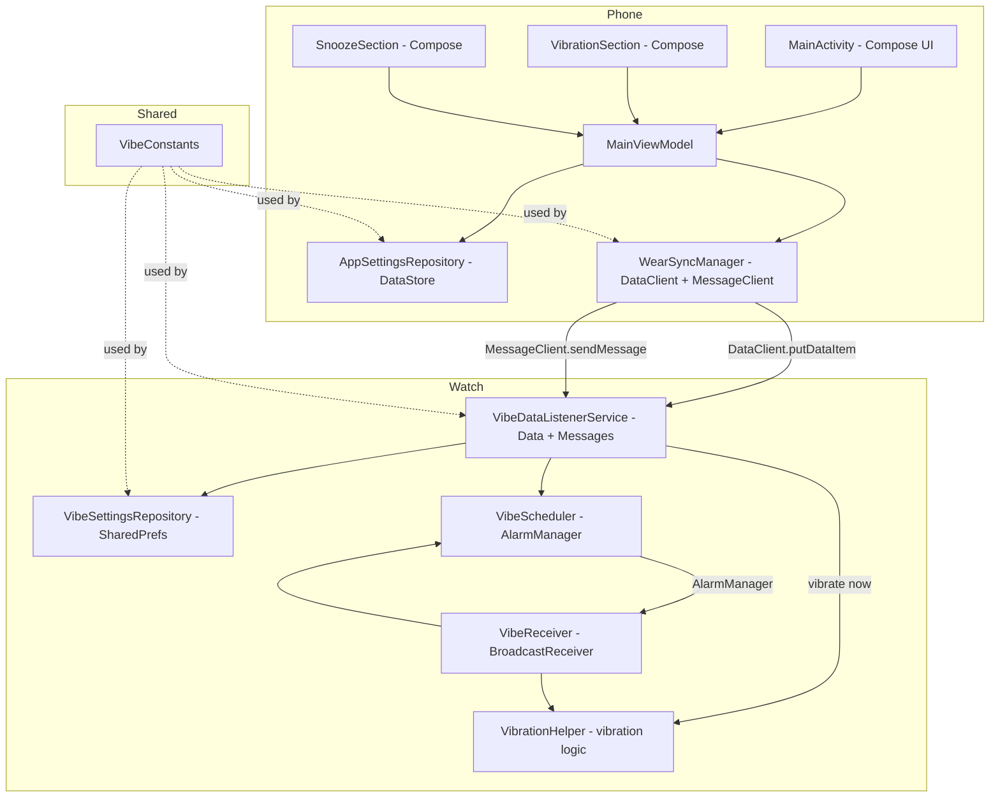

# VILD – System Patterns

> Last updated: 2026-03-29T15:16 UTC-6

## Architecture Overview



## Key Patterns

### 1. Unidirectional Data Flow - Phone to Watch

Settings flow in one direction only:
1. User changes a setting in the Compose UI.
2. `MainViewModel.updateAndSync()` saves locally via `AppSettingsRepository` AND pushes to the Data Layer via `WearSyncManager`.
3. The watch's `VibeDataListenerService` receives the update, persists to `VibeSettingsRepository`, and triggers `VibeScheduler`.

### 2. Shared Constants Module

The `:shared` module contains `VibeConstants` — a single Kotlin `object` with all Data Layer paths and DataMap keys. Both `:app` and `:wear` depend on `:shared`, ensuring key strings are never duplicated or mismatched.

### 3. AlarmManager + BroadcastReceiver Chain

The vibration scheduling uses a self-rescheduling pattern:
1. `VibeScheduler.schedule()` sets an exact alarm via `AlarmManager.setExactAndAllowWhileIdle()`.
2. When the alarm fires, `VibeReceiver.onReceive()` vibrates the device and calls `VibeScheduler.schedule()` again to set the next alarm.
3. This creates a continuous chain of random-interval vibrations.

### 4. Target Node Filtering

Before scheduling an alarm, `VibeScheduler.isThisNodeTargeted()` checks:
- If `target_node_id == "all"` → schedule (all watches active).
- Otherwise, fetch the local node ID via `Wearable.getNodeClient().localNode` and compare.
- If no match → cancel any existing alarm.

### 5. goAsync + Coroutine in BroadcastReceiver

`VibeReceiver` uses `goAsync()` to extend the receiver lifecycle, then launches a coroutine to perform the suspend call to `VibeScheduler.schedule()` (which fetches the local node ID). A `WakeLock` ensures the device stays awake during this work.

### 6. ViewModel as Single Coordinator

`MainViewModel` is the sole coordinator between the UI, local persistence, and Data Layer sync. Every `update*()` method follows the same pattern:
1. Update the in-memory `StateFlow`.
2. Launch a coroutine to save locally + push to Data Layer.

### 7. DataStore vs SharedPreferences

- **Phone side**: Uses Jetpack DataStore Preferences (reactive `Flow`-based API).
- **Watch side**: Uses plain `SharedPreferences` (simpler, synchronous reads needed by `VibeReceiver`).

### 8. Dual Communication Channels - NEW

- **DataClient** (`putDataItem`) — for persistent settings that must survive disconnections. Used for all configuration (intensity, frequency, snooze, pattern, etc.).
- **MessageClient** (`sendMessage`) — for fire-and-forget commands. Used for the "Vibrate Now" one-shot command. Does not persist; requires the watch to be connected.

### 9. Extracted VibrationHelper - NEW

Vibration logic is extracted from `VibeReceiver` into a standalone `VibrationHelper` object. This allows both scheduled vibrations (from `VibeReceiver`) and immediate vibrations (from `VibeDataListenerService.onMessageReceived()`) to share the same pattern/intensity/duration logic.

### 10. UI Decomposition - NEW

The phone Compose UI is split into focused composable files to keep each under 500 lines:
- `MainActivity.kt` — scaffold, master toggle, node selector, frequency sliders
- `ui/VibrationSection.kt` — intensity, duration, pattern, repeat, Vibrate Now button
- `ui/SnoozeSection.kt` — countdown, default snooze buttons, custom snooze management

## File Organization

```
VILD/
├── app/                          # Phone companion - com.example.vild
│   └── src/main/java/.../
│       ├── MainActivity.kt       # Compose UI entry point
│       ├── MainViewModel.kt      # UI state + coordination
│       ├── data/
│       │   ├── AppSettingsRepository.kt  # DataStore persistence
│       │   └── WearSyncManager.kt        # Data Layer push + MessageClient
│       └── ui/
│           ├── VibrationSection.kt       # Vibration settings composables - NEW
│           ├── SnoozeSection.kt          # Snooze composables - NEW
│           └── theme/                    # Material 3 theme
├── wear/                         # Wear OS worker - com.example.vild.wear
│   └── src/main/java/.../wear/
│       ├── MainActivity.kt               # Minimal launcher - calls finish
│       ├── VibeDataListenerService.kt    # Data Layer + Message listener
│       ├── VibeSettingsRepository.kt     # SharedPreferences storage
│       ├── VibeScheduler.kt              # AlarmManager scheduling
│       ├── VibeReceiver.kt               # Alarm handler - delegates to VibrationHelper
│       └── VibrationHelper.kt            # Vibration logic with patterns - NEW
├── shared/                       # Shared library - com.example.vild.shared
│   └── src/main/java/.../shared/
│       └── VibeConstants.kt              # Paths and keys
└── plans/
    └── new-features-plan.md              # Detailed implementation plan
```
