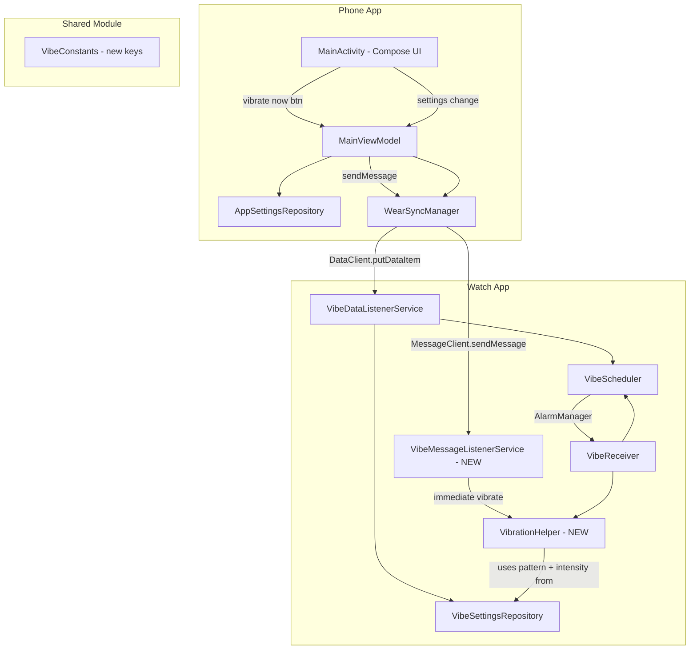

# VILD New Features – Implementation Plan

> Created: 2026-03-29T15:14 UTC-6

## Answer to User Question: Watch App Launcher Behavior

**Yes, the watch app is intentionally headless.** The [`wear/src/main/AndroidManifest.xml`](wear/src/main/AndroidManifest.xml) does declare a launcher activity (lines 18–25):

```xml
<activity android:name=".MainActivity" android:exported="true">
    <intent-filter>
        <action android:name="android.intent.action.MAIN" />
        <category android:name="android.intent.category.LAUNCHER" />
    </intent-filter>
</activity>
```

However, [`wear/src/main/java/com/example/vild/wear/MainActivity.kt`](wear/src/main/java/com/example/vild/wear/MainActivity.kt:11) immediately calls `finish()` in `onCreate()` — it exists solely so Android Studio can deploy the APK via a run configuration. The real work is done by [`VibeDataListenerService`](wear/src/main/java/com/example/vild/wear/VibeDataListenerService.kt:16) (a `WearableListenerService` that wakes up when the phone pushes settings) and [`VibeReceiver`](wear/src/main/java/com/example/vild/wear/VibeReceiver.kt:22) (a `BroadcastReceiver` fired by `AlarmManager`).

**So yes — the watch app runs entirely in the background. The whole interface is through the phone app.** After sideloading via ADB, you won't see a persistent app icon or UI on the watch. The app activates when the phone companion pushes settings via the Wearable Data Layer.

---

## New Features Overview

### Feature A: Immediate Vibrate Button
A button on the phone that sends an immediate vibration command to the watch using the currently configured intensity and pattern.

### Feature B: Custom Snooze Buttons
Allow users to create, save, and delete custom snooze durations on the phone (beyond the hardcoded 15/30/60 min).

### Feature C: Snooze Status Display
Show on the phone how long the watch has been snoozing (countdown timer).

### Feature D: Vibration Customization
Allow customizing vibration duration, pattern type, and repeat count. The existing vibration test button (Feature A) should use these settings.

---

## Architecture

### Data Flow for New Features



### Key Design Decisions

| Decision | Rationale |
|----------|-----------|
| Use `MessageClient` for immediate vibrate | `DataClient` is for persistent state; `MessageClient` is fire-and-forget, perfect for one-shot commands |
| New `VibrationHelper` on watch | Extract vibration logic from `VibeReceiver` into a shared helper so both scheduled and immediate vibrations use the same pattern/intensity settings |
| Store custom snooze durations in DataStore on phone only | Custom snooze durations are a phone-UI concern; the watch only needs the resulting `snooze_until_timestamp` |
| Add vibration pattern settings to the Data Layer | Pattern, duration, and repeat count need to reach the watch alongside existing settings |
| Snooze countdown is phone-side only | The phone already stores `snooze_until_timestamp`; a periodic UI refresh shows the remaining time |

---

## Detailed Implementation Steps

### Step 1: Add New Constants to Shared Module

**File:** [`shared/src/main/java/com/example/vild/shared/VibeConstants.kt`](shared/src/main/java/com/example/vild/shared/VibeConstants.kt)

Add:
- `PATH_VIBRATE_NOW = "/vibrate_now"` — MessageClient path for immediate vibrate command
- `KEY_VIBRATION_DURATION_MS = "vibration_duration_ms"` — Long, single-pulse duration in ms (default 500)
- `KEY_VIBRATION_PATTERN_TYPE = "vibration_pattern_type"` — String enum: `"single"`, `"double"`, `"triple"`, `"ramp"` (default `"single"`)
- `KEY_VIBRATION_REPEAT_COUNT = "vibration_repeat_count"` — Int, how many times to repeat the pattern (default 1)

### Step 2: Update VibeSettings Data Class

**File:** [`app/src/main/java/com/example/vild/data/AppSettingsRepository.kt`](app/src/main/java/com/example/vild/data/AppSettingsRepository.kt)

Add to `VibeSettings`:
- `vibrationDurationMs: Long = 500L`
- `vibrationPatternType: String = "single"`
- `vibrationRepeatCount: Int = 1`
- `customSnoozeDurations: List<Long> = emptyList()` — stored as comma-separated string in DataStore

Update `AppSettingsRepository`:
- Add DataStore keys for the new fields
- Update `settingsFlow` mapping
- Update `save()` method

### Step 3: Update WearSyncManager

**File:** [`app/src/main/java/com/example/vild/data/WearSyncManager.kt`](app/src/main/java/com/example/vild/data/WearSyncManager.kt)

- Add new vibration fields to `pushSettings()` DataMap
- Add `sendVibrateNow(nodeId: String)` method using `MessageClient.sendMessage()`

### Step 4: Update Watch-Side VibeSettingsRepository

**File:** [`wear/src/main/java/com/example/vild/wear/VibeSettingsRepository.kt`](wear/src/main/java/com/example/vild/wear/VibeSettingsRepository.kt)

Add getters for:
- `vibrationDurationMs(context)`
- `vibrationPatternType(context)`
- `vibrationRepeatCount(context)`

Update `save()` to include the new fields.

### Step 5: Create VibrationHelper on Watch

**New file:** `wear/src/main/java/com/example/vild/wear/VibrationHelper.kt`

Extract and enhance vibration logic from `VibeReceiver`:
- `fun vibrate(context: Context)` — reads pattern type, duration, intensity, and repeat count from `VibeSettingsRepository` and builds the appropriate `VibrationEffect`
- Pattern implementations:
  - `"single"` → `createOneShot(durationMs, intensity)`
  - `"double"` → `createWaveform(timings, amplitudes, -1)` with two pulses
  - `"triple"` → three pulses
  - `"ramp"` → waveform that ramps up intensity

### Step 6: Update VibeReceiver to Use VibrationHelper

**File:** [`wear/src/main/java/com/example/vild/wear/VibeReceiver.kt`](wear/src/main/java/com/example/vild/wear/VibeReceiver.kt)

Replace the inline `vibrate()` method with a call to `VibrationHelper.vibrate(context)`.

### Step 7: Update VibeDataListenerService

**File:** [`wear/src/main/java/com/example/vild/wear/VibeDataListenerService.kt`](wear/src/main/java/com/example/vild/wear/VibeDataListenerService.kt)

Update `onDataChanged()` to extract and save the new vibration pattern fields.

### Step 8: Create VibeMessageListenerService on Watch

**New file:** `wear/src/main/java/com/example/vild/wear/VibeMessageListenerService.kt`

- Extends `WearableListenerService`
- Overrides `onMessageReceived(messageEvent)`
- If path == `VibeConstants.PATH_VIBRATE_NOW`, calls `VibrationHelper.vibrate(context)`
- Register in [`wear/src/main/AndroidManifest.xml`](wear/src/main/AndroidManifest.xml) with `MESSAGE_RECEIVED` intent filter

**Alternative approach:** Merge message handling into the existing `VibeDataListenerService` by also overriding `onMessageReceived()` there. This avoids a new service class. **Recommended: merge into existing service.**

### Step 9: Update MainViewModel

**File:** [`app/src/main/java/com/example/vild/MainViewModel.kt`](app/src/main/java/com/example/vild/MainViewModel.kt)

Add:
- `updateVibrationDurationMs(ms: Long)`
- `updateVibrationPatternType(type: String)`
- `updateVibrationRepeatCount(count: Int)`
- `vibrateNow()` — calls `syncManager.sendVibrateNow(targetNodeId)`
- `addCustomSnoozeDuration(durationMs: Long)`
- `removeCustomSnoozeDuration(durationMs: Long)`
- `snoozeCountdownText: StateFlow<String?>` — derived from `snoozeUntilTimestamp`, updated periodically

### Step 10: Update Phone UI (MainActivity.kt)

**File:** [`app/src/main/java/com/example/vild/MainActivity.kt`](app/src/main/java/com/example/vild/MainActivity.kt)

This file is currently 250 lines. With the new features it will grow significantly. **Extract UI sections into separate composable files** to stay under 500 lines:

#### New file: `app/src/main/java/com/example/vild/ui/VibrationSection.kt`
- Vibration intensity slider (moved from MainActivity)
- Vibration duration slider (new): 100ms–2000ms
- Pattern type selector (new): dropdown with single/double/triple/ramp
- Repeat count selector (new): 1–5
- **Vibrate Now** button (new)

#### New file: `app/src/main/java/com/example/vild/ui/SnoozeSection.kt`
- Snooze status countdown (new): shows "Snoozed — X min Y sec remaining" with live countdown
- Default snooze buttons (15/30/60 min — moved from MainActivity)
- Custom snooze buttons (new): user-created durations
- Add custom snooze button (new): opens a simple dialog to enter minutes
- Delete custom snooze (new): long-press or X button on custom entries

#### Refactored `MainActivity.kt`
- Keep `VildApp()` composable as the scaffold
- Import and call `VibrationSection()` and `SnoozeSection()`
- Keep master toggle, node selector, and frequency sliders inline (they're small)

### Step 11: Update Wear AndroidManifest

**File:** [`wear/src/main/AndroidManifest.xml`](wear/src/main/AndroidManifest.xml)

If using the merged approach (recommended), add `MESSAGE_RECEIVED` intent filter to the existing `VibeDataListenerService`:
```xml
<intent-filter>
    <action android:name="com.google.android.gms.wearable.MESSAGE_RECEIVED" />
    <data android:host="*" android:pathPrefix="/vibrate_now" android:scheme="wear" />
</intent-filter>
```

### Step 12: Update Memory Bank and README

Update all memory bank files and README.md to reflect the new features.

---

## Files Summary

| Action | File | Description |
|--------|------|-------------|
| Modify | `shared/.../VibeConstants.kt` | Add new keys for vibration pattern, duration, repeat, and message path |
| Modify | `app/.../data/AppSettingsRepository.kt` | Add new fields to `VibeSettings` and DataStore keys |
| Modify | `app/.../data/WearSyncManager.kt` | Push new fields + add `sendVibrateNow()` via MessageClient |
| Modify | `app/.../MainViewModel.kt` | Add update methods for new settings, vibrateNow, custom snooze, countdown |
| Modify | `app/.../MainActivity.kt` | Refactor to use extracted section composables |
| Create | `app/.../ui/VibrationSection.kt` | Vibration settings UI + Vibrate Now button |
| Create | `app/.../ui/SnoozeSection.kt` | Snooze buttons + countdown + custom snooze management |
| Create | `wear/.../VibrationHelper.kt` | Shared vibration logic with pattern support |
| Modify | `wear/.../VibeReceiver.kt` | Delegate to VibrationHelper |
| Modify | `wear/.../VibeDataListenerService.kt` | Handle new fields + add `onMessageReceived()` for vibrate-now |
| Modify | `wear/.../VibeSettingsRepository.kt` | Add new field getters/setters |
| Modify | `wear/src/main/AndroidManifest.xml` | Add MESSAGE_RECEIVED intent filter |
| Modify | `memory-bank/*.md` | Update all memory bank files |
| Modify | `README.md` | Document new features |
