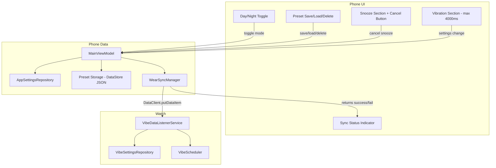

# VILD New Features – Implementation Plan (v2)

> Created: 2026-03-29T15:46 UTC-6

## User Questions – Answers

### How does syncing work? Does the watch remember settings?

**The Android Wear Data Layer auto-syncs.** When you change a setting on the phone, [`MainViewModel.updateAndSync()`](app/src/main/java/com/example/vild/MainViewModel.kt:166) saves it locally via [`AppSettingsRepository`](app/src/main/java/com/example/vild/data/AppSettingsRepository.kt:22) AND pushes the full settings snapshot to the Wearable Data Layer via [`WearSyncManager.pushSettings()`](app/src/main/java/com/example/vild/data/WearSyncManager.kt:51). The Data Layer uses `DataClient.putDataItem()` with `setUrgent()`, which delivers immediately to all connected watches. If a watch is offline, the Data Layer **queues** the update and delivers it automatically when the watch reconnects.

**Yes, the watch remembers settings.** On the watch side, [`VibeDataListenerService.onDataChanged()`](wear/src/main/java/com/example/vild/wear/VibeDataListenerService.kt:25) receives the update and persists it to [`VibeSettingsRepository`](wear/src/main/java/com/example/vild/wear/VibeSettingsRepository.kt:11) (SharedPreferences). The watch operates autonomously from that point — it does not need the phone to be connected to vibrate on schedule.

**What we will add:** A sync status indicator in the phone UI showing whether the last push succeeded or failed, and the timestamp of the last successful sync.

### Can intensity go above 255?

**No — 255 is the Android hardware limit.** The `VibrationEffect` API uses an `int` amplitude parameter clamped to 1–255, where 255 is the maximum the motor can produce. This is an OS-level constraint, not a VILD limitation. The slider in [`VibrationSection.kt`](app/src/main/java/com/example/vild/ui/VibrationSection.kt:43) already enforces `valueRange = 1f..255f`.

### Can the duration slider max be increased to 4000?

**Yes.** The current max is 2000ms in [`VibrationSection.kt`](app/src/main/java/com/example/vild/ui/VibrationSection.kt:59). We will increase it to 4000ms.

---

## New Features Overview

### Feature 1: Sync Status Indicator
Show sync state in the phone UI — last sync timestamp and success/failure status.

### Feature 2: Duration Slider Max → 4000ms
Increase the duration slider maximum from 2000ms to 4000ms.

### Feature 3: Named Presets (Save / Load / Delete)
Allow users to save all current settings as a named preset, load a preset by name, and delete presets.

### Feature 4: Snooze Improvements (Delete + Cancel Active)
Allow deleting custom snooze durations (already exists) and easily cancelling an active snooze.

### Feature 5: Day/Night Mode
A toggle at the top of the screen for Day vs Night mode. Each mode stores its own independent settings. Named presets can be loaded into either mode.

---

## Architecture

### Data Model for Presets

A preset captures all vibration/scheduling settings (but NOT snooze state or target node, which are transient/device-specific):

```kotlin
data class Preset(
    val name: String,
    val isEnabled: Boolean,
    val freqMinMinutes: Int,
    val freqMaxMinutes: Int,
    val vibrationIntensity: Int,
    val vibrationDurationMs: Long,
    val vibrationPatternType: String,
    val vibrationRepeatCount: Int,
)
```

**Storage:** Presets are stored as a JSON array string in DataStore Preferences under a single key `"presets_json"`. This avoids needing Room/SQLite for a simple list of named snapshots. We use `kotlinx.serialization` (already available via Kotlin) to serialize/deserialize.

### Data Model for Day/Night Mode

Day/Night mode is implemented as two independent `VibeSettings` snapshots stored under prefixed keys:

```
day_is_enabled, day_freq_min_minutes, day_vibration_intensity, ...
night_is_enabled, night_freq_min_minutes, night_vibration_intensity, ...
```

A single `active_mode` key (`"day"` or `"night"`) determines which set of settings is currently active and synced to the watch. When the user toggles the mode, the app:
1. Saves the current settings under the outgoing mode prefix.
2. Loads the incoming mode settings.
3. Pushes the incoming mode settings to the watch.

The watch does NOT know about Day/Night mode — it just receives whatever settings are active.

### Sync Status

[`WearSyncManager.pushSettings()`](app/src/main/java/com/example/vild/data/WearSyncManager.kt:51) currently catches exceptions silently. We will make it return a result and expose a `SyncStatus` state in the ViewModel:

```kotlin
data class SyncStatus(
    val lastSyncTimestamp: Long = 0L,
    val lastSyncSuccess: Boolean = true,
)
```

### Data Flow Diagram



---

## Detailed Implementation Steps

### Phase 1: Simple Changes (Duration Slider + Snooze Cancel)

#### Step 1.1: Increase Duration Slider Max to 4000ms

**File:** [`app/src/main/java/com/example/vild/ui/VibrationSection.kt`](app/src/main/java/com/example/vild/ui/VibrationSection.kt:56)

- Change `valueRange = 100f..2000f` → `valueRange = 100f..4000f`
- Update `steps` calculation: `(4000-100)/50 - 1 = 77`
- Update the label to show seconds when ≥ 1000ms (e.g., "1.5 sec" instead of "1500 ms")

#### Step 1.2: Add Cancel Snooze Button

**File:** [`app/src/main/java/com/example/vild/ui/SnoozeSection.kt`](app/src/main/java/com/example/vild/ui/SnoozeSection.kt:31)

- When `countdownText != null` (snooze is active), show a "Cancel Snooze" button next to the countdown text.
- Clicking it calls `vm.cancelSnooze()`.

**File:** [`app/src/main/java/com/example/vild/MainViewModel.kt`](app/src/main/java/com/example/vild/MainViewModel.kt:138)

- Add `fun cancelSnooze()` that sets `snoozeUntilTimestamp = 0L` and syncs.

### Phase 2: Sync Status Indicator

#### Step 2.1: Add SyncStatus to ViewModel

**File:** [`app/src/main/java/com/example/vild/MainViewModel.kt`](app/src/main/java/com/example/vild/MainViewModel.kt:33)

- Add `data class SyncStatus(val lastSyncTimestamp: Long, val lastSyncSuccess: Boolean)`
- Add `private val _syncStatus = MutableStateFlow(SyncStatus(0L, true))`
- Expose `val syncStatus: StateFlow<SyncStatus>`

#### Step 2.2: Return Sync Result from WearSyncManager

**File:** [`app/src/main/java/com/example/vild/data/WearSyncManager.kt`](app/src/main/java/com/example/vild/data/WearSyncManager.kt:51)

- Change `pushSettings()` return type from `Unit` to `Boolean` (true = success).
- Return `true` after successful `putDataItem`, `false` in the catch block.

#### Step 2.3: Update updateAndSync to Track Status

**File:** [`app/src/main/java/com/example/vild/MainViewModel.kt`](app/src/main/java/com/example/vild/MainViewModel.kt:166)

- After `syncManager.pushSettings()`, update `_syncStatus` with timestamp and result.

#### Step 2.4: Show Sync Status in UI

**File:** [`app/src/main/java/com/example/vild/MainActivity.kt`](app/src/main/java/com/example/vild/MainActivity.kt:64)

- Below the TopAppBar or near the Node Selector, show a small text/icon:
  - Green checkmark + "Synced X sec ago" when successful
  - Red warning + "Sync failed" when last push failed

### Phase 3: Named Presets

#### Step 3.1: Add Preset Data Class

**New file:** `app/src/main/java/com/example/vild/data/Preset.kt`

```kotlin
@Serializable
data class Preset(
    val name: String,
    val isEnabled: Boolean = false,
    val freqMinMinutes: Int = 30,
    val freqMaxMinutes: Int = 60,
    val vibrationIntensity: Int = 128,
    val vibrationDurationMs: Long = 500L,
    val vibrationPatternType: String = "single",
    val vibrationRepeatCount: Int = 1,
)
```

#### Step 3.2: Add Preset Storage to AppSettingsRepository

**File:** [`app/src/main/java/com/example/vild/data/AppSettingsRepository.kt`](app/src/main/java/com/example/vild/data/AppSettingsRepository.kt:22)

- Add `private val keyPresets = stringPreferencesKey("presets_json")`
- Add `val presetsFlow: Flow<List<Preset>>` — deserializes JSON from DataStore
- Add `suspend fun savePreset(preset: Preset)` — adds/replaces by name
- Add `suspend fun deletePreset(name: String)` — removes by name

#### Step 3.3: Add Preset Methods to MainViewModel

**File:** [`app/src/main/java/com/example/vild/MainViewModel.kt`](app/src/main/java/com/example/vild/MainViewModel.kt:33)

- Add `val presets: StateFlow<List<Preset>>` — collected from repo
- Add `fun saveCurrentAsPreset(name: String)` — snapshots current settings into a Preset and saves
- Add `fun loadPreset(preset: Preset)` — applies preset values to current settings and syncs
- Add `fun deletePreset(name: String)` — removes from storage

#### Step 3.4: Create Preset UI Section

**New file:** `app/src/main/java/com/example/vild/ui/PresetSection.kt`

- "Save Preset" button → opens dialog asking for a name
- List of saved presets, each with:
  - Name label
  - "Load" button → applies settings
  - "Delete" button (with confirmation) → removes preset
- If no presets exist, show "No saved presets" placeholder text

#### Step 3.5: Add PresetSection to MainActivity

**File:** [`app/src/main/java/com/example/vild/MainActivity.kt`](app/src/main/java/com/example/vild/MainActivity.kt:64)

- Add a "Presets" section between the Vibration and Snooze sections (or at the bottom).

### Phase 4: Day/Night Mode

#### Step 4.1: Add Day/Night Mode Storage

**File:** [`app/src/main/java/com/example/vild/data/AppSettingsRepository.kt`](app/src/main/java/com/example/vild/data/AppSettingsRepository.kt:22)

- Add `private val keyActiveMode = stringPreferencesKey("active_mode")` — `"day"` or `"night"`
- Add `private val keyDaySettings = stringPreferencesKey("day_settings_json")`
- Add `private val keyNightSettings = stringPreferencesKey("night_settings_json")`
- Add `val activeModeFlow: Flow<String>` — emits `"day"` or `"night"`
- Add `suspend fun saveModeSettings(mode: String, settings: VibeSettings)`
- Add `suspend fun loadModeSettings(mode: String): VibeSettings`
- Add `suspend fun setActiveMode(mode: String)`

**Design note:** Day/Night settings are serialized as JSON strings in DataStore. This keeps the storage flat and avoids duplicating every preference key with a prefix.

#### Step 4.2: Add Day/Night Mode to MainViewModel

**File:** [`app/src/main/java/com/example/vild/MainViewModel.kt`](app/src/main/java/com/example/vild/MainViewModel.kt:33)

- Add `val activeMode: StateFlow<String>` — `"day"` or `"night"`
- Add `fun toggleMode()`:
  1. Save current settings under the current mode.
  2. Switch `activeMode` to the other mode.
  3. Load the other mode's settings.
  4. Update `_settings` and sync to watch.
- Modify `loadPreset()` to also save the loaded preset into the current mode's storage.

#### Step 4.3: Add Day/Night Toggle to UI

**File:** [`app/src/main/java/com/example/vild/MainActivity.kt`](app/src/main/java/com/example/vild/MainActivity.kt:64)

- At the very top of the Column (before "Reminders"), add a segmented button or toggle:
  - ☀️ Day / 🌙 Night
  - Clicking toggles the mode and reloads settings.
- Visual indicator of which mode is active (e.g., different background tint or icon).

#### Step 4.4: Allow Loading Presets into Day/Night Modes

The existing `loadPreset()` function already applies settings to the current mode. Since the Day/Night toggle determines which mode is active, loading a preset while in "Night" mode automatically configures the Night settings. No additional logic needed — the UX is:
1. Toggle to Night mode.
2. Load a preset → Night mode now uses those settings.
3. Toggle to Day mode.
4. Load a different preset → Day mode now uses those settings.

### Phase 5: Add kotlinx.serialization Dependency

#### Step 5.0: Update Build Configuration

**File:** [`gradle/libs.versions.toml`](gradle/libs.versions.toml)
- Add `kotlinx-serialization-json` version entry

**File:** [`app/build.gradle.kts`](app/build.gradle.kts)
- Add `kotlin("plugin.serialization")` plugin
- Add `kotlinx-serialization-json` dependency

This is needed for Preset and Day/Night settings JSON serialization.

---

## Implementation Order (Recommended)

1. **Phase 5** — Add serialization dependency (prerequisite for Phases 3 & 4)
2. **Phase 1** — Duration slider + snooze cancel (quick wins, no new data structures)
3. **Phase 2** — Sync status indicator (small scope, improves UX immediately)
4. **Phase 3** — Named presets (new data layer, new UI section)
5. **Phase 4** — Day/Night mode (builds on presets infrastructure)

---

## Files Summary

| Action | File | Phase | Description |
|--------|------|-------|-------------|
| Modify | [`gradle/libs.versions.toml`](gradle/libs.versions.toml) | 5 | Add kotlinx-serialization-json |
| Modify | [`app/build.gradle.kts`](app/build.gradle.kts) | 5 | Add serialization plugin + dependency |
| Modify | [`app/.../ui/VibrationSection.kt`](app/src/main/java/com/example/vild/ui/VibrationSection.kt) | 1 | Duration slider max → 4000ms |
| Modify | [`app/.../ui/SnoozeSection.kt`](app/src/main/java/com/example/vild/ui/SnoozeSection.kt) | 1 | Add Cancel Snooze button |
| Modify | [`app/.../MainViewModel.kt`](app/src/main/java/com/example/vild/MainViewModel.kt) | 1-4 | cancelSnooze, syncStatus, presets, day/night mode |
| Modify | [`app/.../data/WearSyncManager.kt`](app/src/main/java/com/example/vild/data/WearSyncManager.kt) | 2 | Return Boolean from pushSettings |
| Modify | [`app/.../data/AppSettingsRepository.kt`](app/src/main/java/com/example/vild/data/AppSettingsRepository.kt) | 3-4 | Preset storage, day/night mode storage |
| Create | `app/.../data/Preset.kt` | 3 | Preset data class with serialization |
| Create | `app/.../ui/PresetSection.kt` | 3 | Preset save/load/delete UI |
| Modify | [`app/.../MainActivity.kt`](app/src/main/java/com/example/vild/MainActivity.kt) | 3-4 | Add PresetSection, Day/Night toggle, sync indicator |
| Modify | `memory-bank/*.md` | — | Update documentation |
| Modify | [`README.md`](README.md) | — | Document new features |

## What Does NOT Change

- **`:shared` module** — No new constants needed. Day/Night mode and presets are phone-only concepts. The watch just receives whatever settings are active.
- **`:wear` module** — No changes. The watch is unaware of presets or day/night mode. It receives the same `VibeSettings` data it always has.
- **Sync mechanism** — Still unidirectional phone → watch via DataClient. No new Data Layer paths needed.
